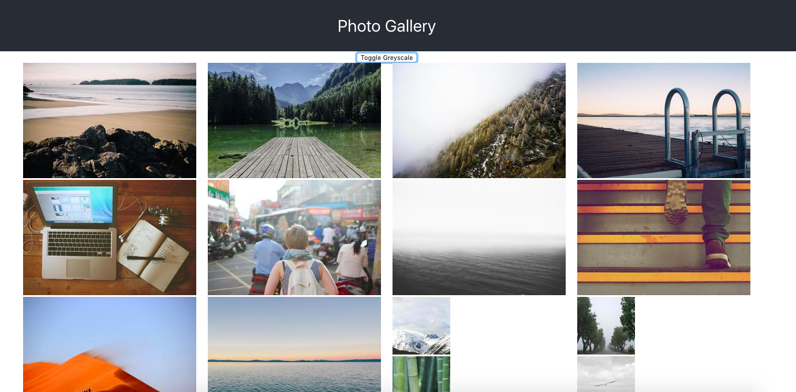
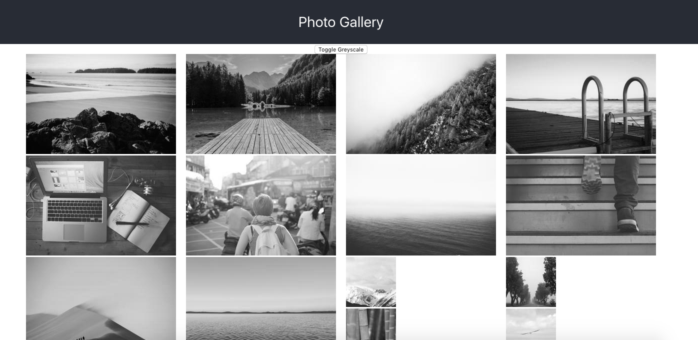
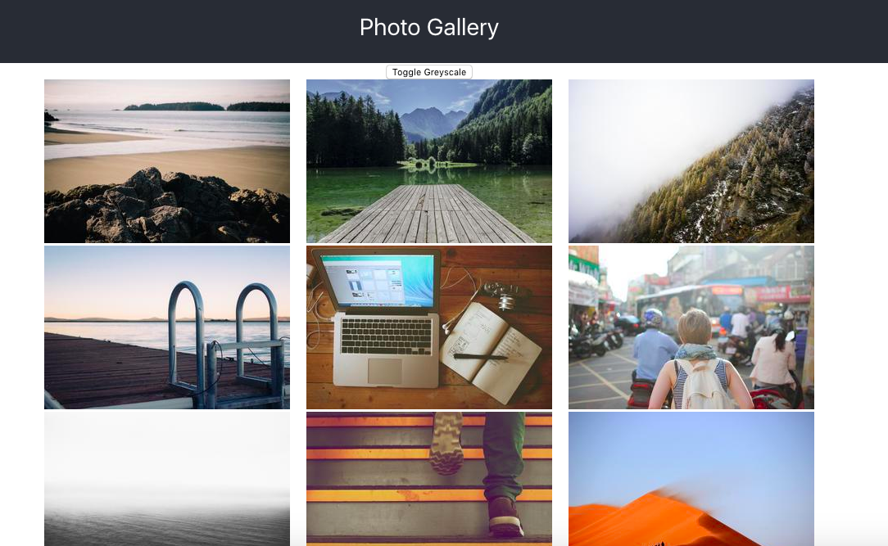

# Photo Gallery 
Sydney McMuldroch

## How to Work
1. Get Back-end running 
- `cd api`
- `python import.py`
- `python app.py`
- `cd ..`
- should be good to go! If you have troubles or want to ensure this is working you can run a curl command detailed in `api/README.md`

2. Start the front-end
- `cd photo_app`
- `npm install`
- `npm start`

_Note -- not complete, but this is what I could accomplished in the time frame :)_

### What it should look like

